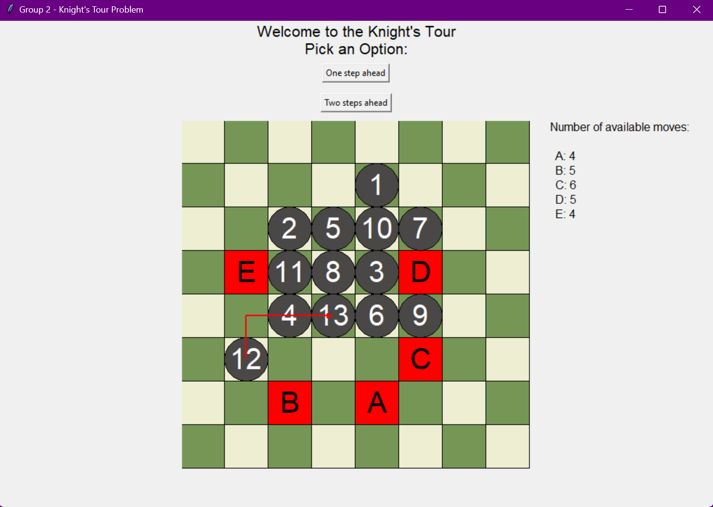
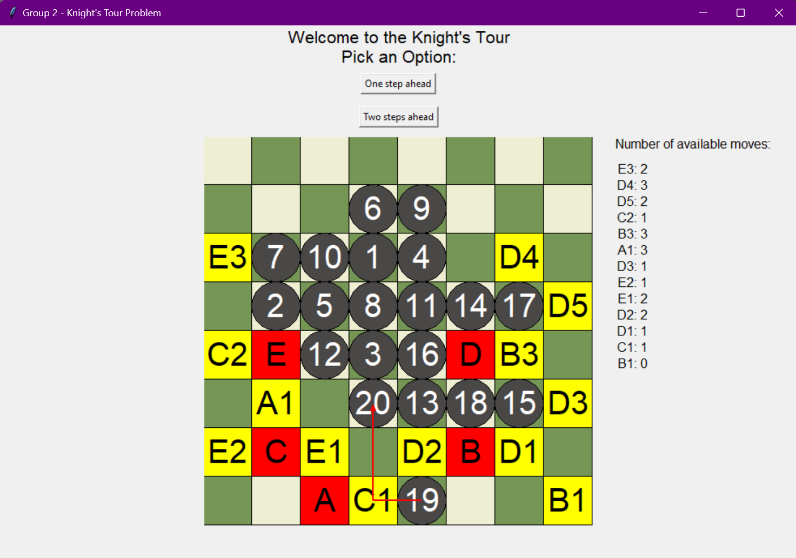

# ♞ Knight’s Tour Visualizer

A visual, interactive Python simulation of the **Knight’s Tour problem** using **lookahead algorithms**. This project demonstrates AI-inspired decision-making by simulating how a knight moves across a chessboard, visiting every square exactly once without repetition. Users can choose between 1-step and 2-step lookahead modes, enabling an engaging way to understand heuristic search strategies.

> 🧠 Developed as part of **AIRE305 – Artificial Intelligence and Robotics Engineering**.

---

## 📌 Project Overview

The **Knight's Tour** is a classic combinatorial problem where a knight must move over every square on a chessboard exactly once. This visualizer allows users to:

- Select a starting square on the board.
- Choose between:
  - **1-step lookahead:** Greedily selects moves with the most future options.
  - **2-step lookahead:** Simulates an extra depth of move possibilities to pick the most strategic path.
- Observe move sequences labeled on the board.
- View arrows representing each knight move in L-shape format.

---

## 🔍 Algorithms Used

### 🟢 Warnsdorff’s Heuristic (Modified)
A variation of Warnsdorff’s Rule is used to pick the knight’s next move:
- The knight moves to the square that has the **least number of onward moves**.
- This is enhanced by **depth-1 and depth-2 lookahead**, where we simulate future paths and rank options.

### 🟡 Lookahead Strategy
- **Depth 1:** For each valid move, count the number of onward moves from that square.
- **Depth 2:** For each valid move, simulate all possible next moves from that square and aggregate the total options (greedy heuristic with expanded foresight).

### 🔺 Greedy Move Selection
- Among available moves (labeled `A`, `B`, etc.), select the move with **maximum downstream mobility**.
- Tiebreakers are resolved alphabetically.

---
## 📸 Visual Examples

### ♟️ One-Step Lookahead Example

In this mode, the knight evaluates **all possible next moves** from its current position and picks the one with the **highest number of available onward moves**.


*Red highlights show valid moves based on one-step prediction.*

--

### ♞ Two-Step Lookahead Example

Here, the knight evaluates the **future outcomes** of each possible move, checking what options each of those leads to (like a search tree with depth = 2), and selects the move that offers the **best cumulative potential**.


*Yellow highlights indicate depth-2 move predictions, allowing smarter path planning.*
---
## 🎮 Features

| Feature | Description |
|--------|-------------|
| 🎯 One-Step Ahead | Highlights immediate options and picks the best based on direct move count. |
| 🧠 Two-Steps Ahead | Computes second-layer options for smarter pathfinding. |
| 🧩 Live Chessboard | Real-time update of knight’s movement and move history. |
| 🔢 Move Numbering | Each move is numbered or labeled for clarity. |
| ↪️ Direction Arrows | Red arrows show actual knight path taken. |
| 🟨 Move Highlighting | Red and yellow blocks distinguish move depths. |
| 🧾 Available Move Counter | Dynamic display of move options for each turn. |

---

## 🛠️ Technologies

| Tool / Library | Purpose |
|----------------|---------|
| `Python 3.x` | Core programming language |
| `Tkinter` | GUI creation and event binding |
| `copy` | Deep copy of chessboard states |
| `time.sleep` | Frame delay for animations |

---

## 🧠 Skills Demonstrated

- **Artificial Intelligence Techniques**: Greedy decision making, recursive move evaluation
- **Depth-Limited Search Heuristics**: Predictive modeling through 1-step and 2-step lookahead
- **Data Structures**: Grids (2D lists), coordinate mapping, queues for move storage
- **Graphical UI Programming**: Responsive design, color-coded canvas, event-based interactivity
- **State Visualization**: Real-time tracking of board states and decision paths

---

## 🚀 How to Run

> ⚠️ Requires Python 3.x

```bash
# Clone this repository
git clone https://github.com/yourusername/knights-tour-visualizer.git
cd knights-tour-visualizer

# Run the visualizer
main.py
